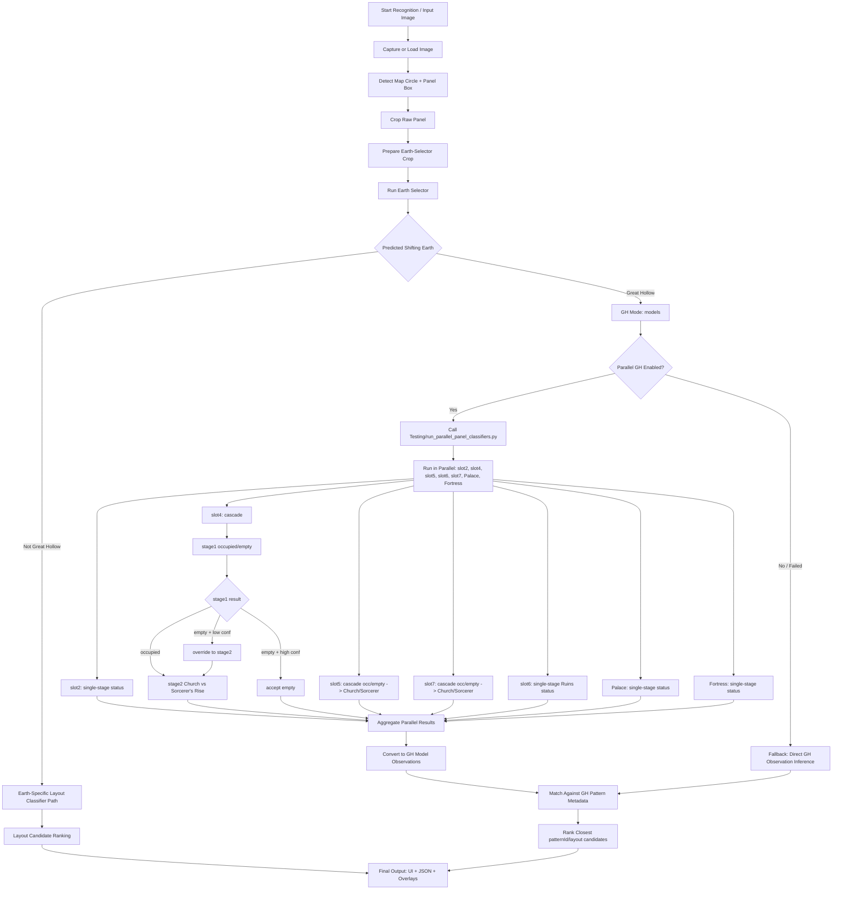

```mermaid
flowchart TD
    A["Start Recognition / Input Image"] --> B["Capture or Load Image"]
    B --> C["Detect Map Circle + Panel Box"]
    C --> D["Crop Raw Panel"]
    D --> E["Prepare Earth-Selector Crop"]
    E --> F["Run Earth Selector"]
    F --> G{Predicted Shifting Earth}

    G -->|"Not Great Hollow"|H["Earth-Specific Layout Classifier Path"]
    H --> I["Layout Candidate Ranking"]
    I --> Z["Final Output: UI + JSON + Overlays"]

    G -->|"Great Hollow"|GH0["GH Mode: models"]
    GH0 --> GH1{Parallel GH Enabled?}

    GH1 -->|"Yes"|P0["Call Testing/run_parallel_panel_classifiers.py"]
    P0 --> P1["Run in Parallel: slot2, slot4, slot5, slot6, slot7, Palace, Fortress"]

    P1 --> S2["slot2: single-stage status"]
    P1 --> S4["slot4: cascade"]
    S4 --> S4a["stage1 occupied/empty"]
    S4a --> S4b{stage1 result}
    S4b -->|"occupied"|S4c["stage2 Church vs Sorcerer's Rise"]
    S4b -->|"empty + high conf"|S4d["accept empty"]
    S4b -->|"empty + low conf"|S4e["override to stage2"]
    S4e --> S4c

    P1 --> S5["slot5: cascade occ/empty -> Church/Sorcerer"]
    P1 --> S7["slot7: cascade occ/empty -> Church/Sorcerer"]
    P1 --> S6["slot6: single-stage Ruins status"]
    P1 --> SP["Palace: single-stage status"]
    P1 --> SF["Fortress: single-stage status"]

    S2 --> P2["Aggregate Parallel Results"]
    S4c --> P2
    S4d --> P2
    S5 --> P2
    S7 --> P2
    S6 --> P2
    SP --> P2
    SF --> P2

    P2 --> P3["Convert to GH Model Observations"]
    P3 --> P4["Match Against GH Pattern Metadata"]
    P4 --> P5["Rank Closest patternId/layout candidates"]
    P5 --> Z

    GH1 -->|"No / Failed"|GH2["Fallback: Direct GH Observation Inference"]
    GH2 --> P4

```